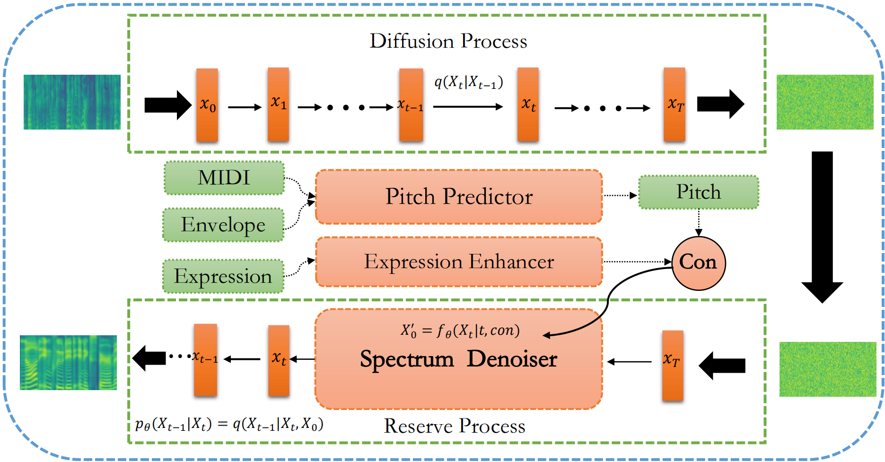

We show the demo of MobileSpeech: A Fast and High-Filelity Framework for Mobile Zero-Shot Text-to-Speech

## Overview

Singing voice beautifying (SVB) is a novel task that is widely used in practical scenarios. SVB task aims to correct the pitch of the singing voice and improve the expressiveness without changing the timbre and content. The major challenge of SVB is that paired data of professional songs and amateur songs is hard to obtain and we solved it for the first time. In this paper, we propose DiffBeautifier, an efficient diffusion model for highfidelity Singing Voice Beautifying. Since there are no paired data, diffusion model is adapted as our backbone, which is combined with modified conditions to generate our mel-spectrograms. We also reduce the number of steps of sampling t by using generator-based methods. For automatic pitch correction, we establish a mapping relationship from MIDI, spectrum envelope to pitch. To make amateur singing more expressive, we propose an expression enhancer in the latent space to convert the amateur vocal tone to the professional one. Furthermore, we produced a 40-hour singing dataset that contains original song vocals and extremely amateurish samples to promote the development of SVB. DiffBeautifier achieves a state-of-the-art beautification effect on both English and Chinese songs. Our extensive ablation studies demonstrate that expression part and generator-based methods in DiffBeautifier are effective.

## Model Architecture
<table>
    <tr>
        <td >
 
</td>
    </tr>
</table>

Figure.1 The overall architecture of DiffBeautifier.

## Singing Audio Samples
There are four models in total: 1) GTMel, amateur (A) and professional (P) version, where we first convert ground truth audio into mel-spectrograms, and then convert the mel-spectrograms back to audio according to the vocoder. 2) Pitch Predictor, we first use the MIDI of the original singer, spectral envelope of amateur singing to predict our pitch curve. And then the predicted pitch curve, the spectral envelope of the amateur singing voice, and the aperiodic parameter of the amateur
singing voice are used to synthesize the audio through the World Vocoder. 3)DiffBeautifier, this is the model proposed in this paper. All four models have a slight electrical sound because of our vocoder Griffin-Lim. Please pay more attention to the pitch and expressiveness of songs.

## Librispeech Test Clean

&nbsp;
 
1.GRACE INVOLVES THE REMISSION OF SINS PEACE AND A HAPPY CONSCIENCE 
<table>
    <tr>
        <th> GT</th>
        <th> GT Codec</th>
        <th> YourTTS</th>
        <th> Valle</th>
        <th> MegaTTS</th>
        <th> MobileSpeech</th>
    </tr>
    <tr>
        <th> <audio controls id="player" onplay="pauseOthers(this);"><source src="assets/audios/waves/1/gtexample.wav" type="audio/mpeg"></audio> </th>
        <th> <audio controls id="player" onplay="pauseOthers(this);"><source src="assets/audios/waves/1/gtcodec.wav" type="audio/mpeg"></audio> </th>
        <th> <audio controls id="player" onplay="pauseOthers(this);"><source src="assets/audios/waves/1/yourtts.wav" type="audio/mpeg"></audio> </th>
        <th> <audio controls id="player" onplay="pauseOthers(this);"><source src="assets/audios/waves/1/valle.wav" type="audio/mpeg"></audio> </th>
        <th> <audio controls id="player" onplay="pauseOthers(this);"><source src="assets/audios/waves/1/megatts.wav" type="audio/mpeg"></audio> </th>
        <th> <audio controls id="player" onplay="pauseOthers(this);"><source src="assets/audios/waves/1/mobilespeech.wav" type="audio/mpeg"></audio> </th>
    </tr>	
</table>

&nbsp;
 
2.OVER THE TRACK LINED CITY STREET THE YOUNG MEN THE GRINNING MEN PASS 
<table>
    <tr>
        <th> GT</th>
        <th> GT Codec</th>
        <th> YourTTS</th>
        <th> Valle</th>
        <th> MegaTTS</th>
        <th> MobileSpeech</th>
    </tr>
    <tr>
        <th> <audio controls id="player" onplay="pauseOthers(this);"><source src="assets/audios/waves/2/gtexample.wav" type="audio/mpeg"></audio> </th>
        <th> <audio controls id="player" onplay="pauseOthers(this);"><source src="assets/audios/waves/2/gtcodec.wav" type="audio/mpeg"></audio> </th>
        <th> <audio controls id="player" onplay="pauseOthers(this);"><source src="assets/audios/waves/2/yourtts.wav" type="audio/mpeg"></audio> </th>
        <th> <audio controls id="player" onplay="pauseOthers(this);"><source src="assets/audios/waves/2/valle.wav" type="audio/mpeg"></audio> </th>
        <th> <audio controls id="player" onplay="pauseOthers(this);"><source src="assets/audios/waves/2/megatts.wav" type="audio/mpeg"></audio> </th>
        <th> <audio controls id="player" onplay="pauseOthers(this);"><source src="assets/audios/waves/2/mobilespeech.wav" type="audio/mpeg"></audio> </th>
    </tr>	
</table>

&nbsp;
 
3.FAIRVIEW WAS TWELVE MILES AWAY BUT BY TEN O'CLOCK THEY DREW UP AT THE COUNTY JAIL 
<table>
    <tr>
        <th> GT</th>
        <th> GT Codec</th>
        <th> YourTTS</th>
        <th> Valle</th>
        <th> MegaTTS</th>
        <th> MobileSpeech</th>
    </tr>
    <tr>
        <th> <audio controls id="player" onplay="pauseOthers(this);"><source src="assets/audios/waves/3/gtexample.wav" type="audio/mpeg"></audio> </th>
        <th> <audio controls id="player" onplay="pauseOthers(this);"><source src="assets/audios/waves/3/gtcodec.wav" type="audio/mpeg"></audio> </th>
        <th> <audio controls id="player" onplay="pauseOthers(this);"><source src="assets/audios/waves/3/yourtts.wav" type="audio/mpeg"></audio> </th>
        <th> <audio controls id="player" onplay="pauseOthers(this);"><source src="assets/audios/waves/3/valle.wav" type="audio/mpeg"></audio> </th>
        <th> <audio controls id="player" onplay="pauseOthers(this);"><source src="assets/audios/waves/3/megatts.wav" type="audio/mpeg"></audio> </th>
        <th> <audio controls id="player" onplay="pauseOthers(this);"><source src="assets/audios/waves/3/mobilespeech.wav" type="audio/mpeg"></audio> </th>
    </tr>	
</table>

&nbsp;
 
4.THE JOHN BRIGHT IS ARMED WITH A WEAPON OF GREAT POWER AGAINST WHICH IT IS IMPOSSIBLE THAT THE PEOPLE OF BRITANNULA SHOULD PREVAIL 
<table>
    <tr>
        <th> GT</th>
        <th> GT Codec</th>
        <th> YourTTS</th>
        <th> Valle</th>
        <th> MegaTTS</th>
        <th> MobileSpeech</th>
    </tr>
    <tr>
        <th> <audio controls id="player" onplay="pauseOthers(this);"><source src="assets/audios/waves/4/gtexample.wav" type="audio/mpeg"></audio> </th>
        <th> <audio controls id="player" onplay="pauseOthers(this);"><source src="assets/audios/waves/4/gtcodec.wav" type="audio/mpeg"></audio> </th>
        <th> <audio controls id="player" onplay="pauseOthers(this);"><source src="assets/audios/waves/4/yourtts.wav" type="audio/mpeg"></audio> </th>
        <th> <audio controls id="player" onplay="pauseOthers(this);"><source src="assets/audios/waves/4/valle.wav" type="audio/mpeg"></audio> </th>
        <th> <audio controls id="player" onplay="pauseOthers(this);"><source src="assets/audios/waves/4/megatts.wav" type="audio/mpeg"></audio> </th>
        <th> <audio controls id="player" onplay="pauseOthers(this);"><source src="assets/audios/waves/4/mobilespeech.wav" type="audio/mpeg"></audio> </th>
    </tr>	
</table>

&nbsp;
 
5.IT IS NECESSARY THEREFORE THAT HE SHOULD COMPLY THE KING FROWNED 
<table>
    <tr>
        <th> GT</th>
        <th> GT Codec</th>
        <th> YourTTS</th>
        <th> Valle</th>
        <th> MegaTTS</th>
        <th> MobileSpeech</th>
    </tr>
    <tr>
        <th> <audio controls id="player" onplay="pauseOthers(this);"><source src="assets/audios/waves/5/gtexample.wav" type="audio/mpeg"></audio> </th>
        <th> <audio controls id="player" onplay="pauseOthers(this);"><source src="assets/audios/waves/5/gtcodec.wav" type="audio/mpeg"></audio> </th>
        <th> <audio controls id="player" onplay="pauseOthers(this);"><source src="assets/audios/waves/5/yourtts.wav" type="audio/mpeg"></audio> </th>
        <th> <audio controls id="player" onplay="pauseOthers(this);"><source src="assets/audios/waves/5/valle.wav" type="audio/mpeg"></audio> </th>
        <th> <audio controls id="player" onplay="pauseOthers(this);"><source src="assets/audios/waves/5/megatts.wav" type="audio/mpeg"></audio> </th>
        <th> <audio controls id="player" onplay="pauseOthers(this);"><source src="assets/audios/waves/5/mobilespeech.wav" type="audio/mpeg"></audio> </th>
    </tr>	
</table>

&nbsp;
 
6.AT THE SUDDEN SHARP STING OF IT THE GREAT BIRD TURNED HIS HEAD AND NOTICED FOR THE FIRST TIME THE FISHERMAN STANDING ON THE BANK 
<table>
    <tr>
        <th> GT</th>
        <th> GT Codec</th>
        <th> YourTTS</th>
        <th> Valle</th>
        <th> MegaTTS</th>
        <th> MobileSpeech</th>
    </tr>
    <tr>
        <th> <audio controls id="player" onplay="pauseOthers(this);"><source src="assets/audios/waves/6/gtexample.wav" type="audio/mpeg"></audio> </th>
        <th> <audio controls id="player" onplay="pauseOthers(this);"><source src="assets/audios/waves/6/gtcodec.wav" type="audio/mpeg"></audio> </th>
        <th> <audio controls id="player" onplay="pauseOthers(this);"><source src="assets/audios/waves/6/yourtts.wav" type="audio/mpeg"></audio> </th>
        <th> <audio controls id="player" onplay="pauseOthers(this);"><source src="assets/audios/waves/6/valle.wav" type="audio/mpeg"></audio> </th>
        <th> <audio controls id="player" onplay="pauseOthers(this);"><source src="assets/audios/waves/6/megatts.wav" type="audio/mpeg"></audio> </th>
        <th> <audio controls id="player" onplay="pauseOthers(this);"><source src="assets/audios/waves/6/mobilespeech.wav" type="audio/mpeg"></audio> </th>
    </tr>	
</table>

&nbsp;
 
7.A STAGE MEAL IS POPULAR BECAUSE IT PROVES TO THE AUDIENCE THAT THE ACTORS EVEN WHEN CALLED CHARLES HAWTREY OR OWEN NARES ARE REAL PEOPLE JUST LIKE YOU AND ME 
<table>
    <tr>
        <th> GT</th>
        <th> GT Codec</th>
        <th> YourTTS</th>
        <th> Valle</th>
        <th> MegaTTS</th>
        <th> MobileSpeech</th>
    </tr>
    <tr>
        <th> <audio controls id="player" onplay="pauseOthers(this);"><source src="assets/audios/waves/7/gtexample.wav" type="audio/mpeg"></audio> </th>
        <th> <audio controls id="player" onplay="pauseOthers(this);"><source src="assets/audios/waves/7/gtcodec.wav" type="audio/mpeg"></audio> </th>
        <th> <audio controls id="player" onplay="pauseOthers(this);"><source src="assets/audios/waves/7/yourtts.wav" type="audio/mpeg"></audio> </th>
        <th> <audio controls id="player" onplay="pauseOthers(this);"><source src="assets/audios/waves/7/valle.wav" type="audio/mpeg"></audio> </th>
        <th> <audio controls id="player" onplay="pauseOthers(this);"><source src="assets/audios/waves/7/megatts.wav" type="audio/mpeg"></audio> </th>
        <th> <audio controls id="player" onplay="pauseOthers(this);"><source src="assets/audios/waves/7/mobilespeech.wav" type="audio/mpeg"></audio> </th>
    </tr>	
</table>

&nbsp;
 
8.WARRENTON SPOKE THUS WITH SIGNIFICANCE TO SHOW ROBIN THAT HE WAS NOT TO THINK GEOFFREY'S CLAIMS TO THE ESTATE WOULD BE PASSED BY 
<table>
    <tr>
        <th> GT</th>
        <th> GT Codec</th>
        <th> YourTTS</th>
        <th> Valle</th>
        <th> MegaTTS</th>
        <th> MobileSpeech</th>
    </tr>
    <tr>
        <th> <audio controls id="player" onplay="pauseOthers(this);"><source src="assets/audios/waves/8/gtexample.wav" type="audio/mpeg"></audio> </th>
        <th> <audio controls id="player" onplay="pauseOthers(this);"><source src="assets/audios/waves/8/gtcodec.wav" type="audio/mpeg"></audio> </th>
        <th> <audio controls id="player" onplay="pauseOthers(this);"><source src="assets/audios/waves/8/yourtts.wav" type="audio/mpeg"></audio> </th>
        <th> <audio controls id="player" onplay="pauseOthers(this);"><source src="assets/audios/waves/8/valle.wav" type="audio/mpeg"></audio> </th>
        <th> <audio controls id="player" onplay="pauseOthers(this);"><source src="assets/audios/waves/8/megatts.wav" type="audio/mpeg"></audio> </th>
        <th> <audio controls id="player" onplay="pauseOthers(this);"><source src="assets/audios/waves/8/mobilespeech.wav" type="audio/mpeg"></audio> </th>
    </tr>	
</table>

&nbsp;
 
9.TAKING ADVANTAGE OF THIS THE SQUIRE'S FEW MEN REDOUBLED THEIR EFFORTS AND ENCOURAGED BY ROBIN'S AND THE LITTLE STROLLER'S CRIES FOUGHT THEIR WAY TO HIM 
<table>
    <tr>
        <th> GT</th>
        <th> GT Codec</th>
        <th> YourTTS</th>
        <th> Valle</th>
        <th> MegaTTS</th>
        <th> MobileSpeech</th>
    </tr>
    <tr>
        <th> <audio controls id="player" onplay="pauseOthers(this);"><source src="assets/audios/waves/9/gtexample.wav" type="audio/mpeg"></audio> </th>
        <th> <audio controls id="player" onplay="pauseOthers(this);"><source src="assets/audios/waves/9/gtcodec.wav" type="audio/mpeg"></audio> </th>
        <th> <audio controls id="player" onplay="pauseOthers(this);"><source src="assets/audios/waves/9/yourtts.wav" type="audio/mpeg"></audio> </th>
        <th> <audio controls id="player" onplay="pauseOthers(this);"><source src="assets/audios/waves/9/valle.wav" type="audio/mpeg"></audio> </th>
        <th> <audio controls id="player" onplay="pauseOthers(this);"><source src="assets/audios/waves/9/megatts.wav" type="audio/mpeg"></audio> </th>
        <th> <audio controls id="player" onplay="pauseOthers(this);"><source src="assets/audios/waves/9/mobilespeech.wav" type="audio/mpeg"></audio> </th>
    </tr>	
</table>

&nbsp;
 
10.HE CRIED IN HIGH DUDGEON JUST AS IF HE OWNED THE WHOLE OF THE PEPPERS AND COULD DISPOSE OF THEM ALL TO SUIT HIS FANCY 
<table>
    <tr>
        <th> GT</th>
        <th> GT Codec</th>
        <th> YourTTS</th>
        <th> Valle</th>
        <th> MegaTTS</th>
        <th> MobileSpeech</th>
    </tr>
    <tr>
        <th> <audio controls id="player" onplay="pauseOthers(this);"><source src="assets/audios/waves/10/gtexample.wav" type="audio/mpeg"></audio> </th>
        <th> <audio controls id="player" onplay="pauseOthers(this);"><source src="assets/audios/waves/10/gtcodec.wav" type="audio/mpeg"></audio> </th>
        <th> <audio controls id="player" onplay="pauseOthers(this);"><source src="assets/audios/waves/10/yourtts.wav" type="audio/mpeg"></audio> </th>
        <th> <audio controls id="player" onplay="pauseOthers(this);"><source src="assets/audios/waves/10/valle.wav" type="audio/mpeg"></audio> </th>
        <th> <audio controls id="player" onplay="pauseOthers(this);"><source src="assets/audios/waves/10/megatts.wav" type="audio/mpeg"></audio> </th>
        <th> <audio controls id="player" onplay="pauseOthers(this);"><source src="assets/audios/waves/10/mobilespeech.wav" type="audio/mpeg"></audio> </th>
    </tr>	
</table>

&nbsp;
 
11.FRANK READ ENGLISH SLOWLY AND THE MORE HE READ ABOUT THIS DIVORCE CASE THE ANGRIER HE GREW 
<table>
    <tr>
        <th> GT</th>
        <th> GT Codec</th>
        <th> YourTTS</th>
        <th> Valle</th>
        <th> MegaTTS</th>
        <th> MobileSpeech</th>
    </tr>
    <tr>
        <th> <audio controls id="player" onplay="pauseOthers(this);"><source src="assets/audios/waves/11/gtexample.wav" type="audio/mpeg"></audio> </th>
        <th> <audio controls id="player" onplay="pauseOthers(this);"><source src="assets/audios/waves/11/gtcodec.wav" type="audio/mpeg"></audio> </th>
        <th> <audio controls id="player" onplay="pauseOthers(this);"><source src="assets/audios/waves/11/yourtts.wav" type="audio/mpeg"></audio> </th>
        <th> <audio controls id="player" onplay="pauseOthers(this);"><source src="assets/audios/waves/11/valle.wav" type="audio/mpeg"></audio> </th>
        <th> <audio controls id="player" onplay="pauseOthers(this);"><source src="assets/audios/waves/11/megatts.wav" type="audio/mpeg"></audio> </th>
        <th> <audio controls id="player" onplay="pauseOthers(this);"><source src="assets/audios/waves/11/mobilespeech.wav" type="audio/mpeg"></audio> </th>
    </tr>	
</table>

&nbsp;
 
12.THAT'S NOT MUCH OF A JOB FOR AN ATHLETE HERE I'VE BEEN TO TOWN AND BACK 
<table>
    <tr>
        <th> GT</th>
        <th> GT Codec</th>
        <th> YourTTS</th>
        <th> Valle</th>
        <th> MegaTTS</th>
        <th> MobileSpeech</th>
    </tr>
    <tr>
        <th> <audio controls id="player" onplay="pauseOthers(this);"><source src="assets/audios/waves/12/gtexample.wav" type="audio/mpeg"></audio> </th>
        <th> <audio controls id="player" onplay="pauseOthers(this);"><source src="assets/audios/waves/12/gtcodec.wav" type="audio/mpeg"></audio> </th>
        <th> <audio controls id="player" onplay="pauseOthers(this);"><source src="assets/audios/waves/12/yourtts.wav" type="audio/mpeg"></audio> </th>
        <th> <audio controls id="player" onplay="pauseOthers(this);"><source src="assets/audios/waves/12/valle.wav" type="audio/mpeg"></audio> </th>
        <th> <audio controls id="player" onplay="pauseOthers(this);"><source src="assets/audios/waves/12/megatts.wav" type="audio/mpeg"></audio> </th>
        <th> <audio controls id="player" onplay="pauseOthers(this);"><source src="assets/audios/waves/12/mobilespeech.wav" type="audio/mpeg"></audio> </th>
    </tr>	
</table>

&nbsp;
 
13.BUT THE WINDOWS ARE PATCHED WITH WOODEN PANES AND THE DOOR I THINK IS LIKE THE GATE IT IS NEVER OPENED 
<table>
    <tr>
        <th> GT</th>
        <th> GT Codec</th>
        <th> YourTTS</th>
        <th> Valle</th>
        <th> MegaTTS</th>
        <th> MobileSpeech</th>
    </tr>
    <tr>
        <th> <audio controls id="player" onplay="pauseOthers(this);"><source src="assets/audios/waves/13/gtexample.wav" type="audio/mpeg"></audio> </th>
        <th> <audio controls id="player" onplay="pauseOthers(this);"><source src="assets/audios/waves/13/gtcodec.wav" type="audio/mpeg"></audio> </th>
        <th> <audio controls id="player" onplay="pauseOthers(this);"><source src="assets/audios/waves/13/yourtts.wav" type="audio/mpeg"></audio> </th>
        <th> <audio controls id="player" onplay="pauseOthers(this);"><source src="assets/audios/waves/13/valle.wav" type="audio/mpeg"></audio> </th>
        <th> <audio controls id="player" onplay="pauseOthers(this);"><source src="assets/audios/waves/13/megatts.wav" type="audio/mpeg"></audio> </th>
        <th> <audio controls id="player" onplay="pauseOthers(this);"><source src="assets/audios/waves/13/mobilespeech.wav" type="audio/mpeg"></audio> </th>
    </tr>	
</table>

&nbsp;
 
14.IT IS SO MADE THAT EVERYWHERE WE FEEL THE SENSE OF PUNISHMENT 
<table>
    <tr>
        <th> GT</th>
        <th> GT Codec</th>
        <th> YourTTS</th>
        <th> Valle</th>
        <th> MegaTTS</th>
        <th> MobileSpeech</th>
    </tr>
    <tr>
        <th> <audio controls id="player" onplay="pauseOthers(this);"><source src="assets/audios/waves/14/gtexample.wav" type="audio/mpeg"></audio> </th>
        <th> <audio controls id="player" onplay="pauseOthers(this);"><source src="assets/audios/waves/14/gtcodec.wav" type="audio/mpeg"></audio> </th>
        <th> <audio controls id="player" onplay="pauseOthers(this);"><source src="assets/audios/waves/14/yourtts.wav" type="audio/mpeg"></audio> </th>
        <th> <audio controls id="player" onplay="pauseOthers(this);"><source src="assets/audios/waves/14/valle.wav" type="audio/mpeg"></audio> </th>
        <th> <audio controls id="player" onplay="pauseOthers(this);"><source src="assets/audios/waves/14/megatts.wav" type="audio/mpeg"></audio> </th>
        <th> <audio controls id="player" onplay="pauseOthers(this);"><source src="assets/audios/waves/14/mobilespeech.wav" type="audio/mpeg"></audio> </th>
    </tr>	
</table>

&nbsp;
 
15.NO ONE WOULD DISTURB THEIR LITTLE HOUSE EVEN IF ANYONE CAME SO FAR INTO THE THICK FOREST WHILE THEY WERE GONE 
<table>
    <tr>
        <th> GT</th>
        <th> GT Codec</th>
        <th> YourTTS</th>
        <th> Valle</th>
        <th> MegaTTS</th>
        <th> MobileSpeech</th>
    </tr>
    <tr>
        <th> <audio controls id="player" onplay="pauseOthers(this);"><source src="assets/audios/waves/15/gtexample.wav" type="audio/mpeg"></audio> </th>
        <th> <audio controls id="player" onplay="pauseOthers(this);"><source src="assets/audios/waves/15/gtcodec.wav" type="audio/mpeg"></audio> </th>
        <th> <audio controls id="player" onplay="pauseOthers(this);"><source src="assets/audios/waves/15/yourtts.wav" type="audio/mpeg"></audio> </th>
        <th> <audio controls id="player" onplay="pauseOthers(this);"><source src="assets/audios/waves/15/valle.wav" type="audio/mpeg"></audio> </th>
        <th> <audio controls id="player" onplay="pauseOthers(this);"><source src="assets/audios/waves/15/megatts.wav" type="audio/mpeg"></audio> </th>
        <th> <audio controls id="player" onplay="pauseOthers(this);"><source src="assets/audios/waves/15/mobilespeech.wav" type="audio/mpeg"></audio> </th>
    </tr>	
</table>

&nbsp;
 
16.WE ARE TRAVELING REPLIED OJO AND WE STOPPED AT YOUR HOUSE JUST TO REST AND REFRESH OURSELVES 
<table>
    <tr>
        <th> GT</th>
        <th> GT Codec</th>
        <th> YourTTS</th>
        <th> Valle</th>
        <th> MegaTTS</th>
        <th> MobileSpeech</th>
    </tr>
    <tr>
        <th> <audio controls id="player" onplay="pauseOthers(this);"><source src="assets/audios/waves/16/gtexample.wav" type="audio/mpeg"></audio> </th>
        <th> <audio controls id="player" onplay="pauseOthers(this);"><source src="assets/audios/waves/16/gtcodec.wav" type="audio/mpeg"></audio> </th>
        <th> <audio controls id="player" onplay="pauseOthers(this);"><source src="assets/audios/waves/16/yourtts.wav" type="audio/mpeg"></audio> </th>
        <th> <audio controls id="player" onplay="pauseOthers(this);"><source src="assets/audios/waves/16/valle.wav" type="audio/mpeg"></audio> </th>
        <th> <audio controls id="player" onplay="pauseOthers(this);"><source src="assets/audios/waves/16/megatts.wav" type="audio/mpeg"></audio> </th>
        <th> <audio controls id="player" onplay="pauseOthers(this);"><source src="assets/audios/waves/16/mobilespeech.wav" type="audio/mpeg"></audio> </th>
    </tr>	
</table>

&nbsp;
 
17.DID EVER ANYBODY SEE THE LIKE SCREAMED MISSUS POYSER RUNNING TOWARDS THE TABLE WHEN HER EYE HAD FALLEN ON THE BLUE STREAM 
<table>
    <tr>
        <th> GT</th>
        <th> GT Codec</th>
        <th> YourTTS</th>
        <th> Valle</th>
        <th> MegaTTS</th>
        <th> MobileSpeech</th>
    </tr>
    <tr>
        <th> <audio controls id="player" onplay="pauseOthers(this);"><source src="assets/audios/waves/17/gtexample.wav" type="audio/mpeg"></audio> </th>
        <th> <audio controls id="player" onplay="pauseOthers(this);"><source src="assets/audios/waves/17/gtcodec.wav" type="audio/mpeg"></audio> </th>
        <th> <audio controls id="player" onplay="pauseOthers(this);"><source src="assets/audios/waves/17/yourtts.wav" type="audio/mpeg"></audio> </th>
        <th> <audio controls id="player" onplay="pauseOthers(this);"><source src="assets/audios/waves/17/valle.wav" type="audio/mpeg"></audio> </th>
        <th> <audio controls id="player" onplay="pauseOthers(this);"><source src="assets/audios/waves/17/megatts.wav" type="audio/mpeg"></audio> </th>
        <th> <audio controls id="player" onplay="pauseOthers(this);"><source src="assets/audios/waves/17/mobilespeech.wav" type="audio/mpeg"></audio> </th>
    </tr>	
</table>

&nbsp;
 
18.SOMEONE ELSE TOLD A STORY NOT PARTICULARLY EFFECTIVE WHICH I SAW HE WAS NOT FOLLOWING 
<table>
    <tr>
        <th> GT</th>
        <th> GT Codec</th>
        <th> YourTTS</th>
        <th> Valle</th>
        <th> MegaTTS</th>
        <th> MobileSpeech</th>
    </tr>
    <tr>
        <th> <audio controls id="player" onplay="pauseOthers(this);"><source src="assets/audios/waves/18/gtexample.wav" type="audio/mpeg"></audio> </th>
        <th> <audio controls id="player" onplay="pauseOthers(this);"><source src="assets/audios/waves/18/gtcodec.wav" type="audio/mpeg"></audio> </th>
        <th> <audio controls id="player" onplay="pauseOthers(this);"><source src="assets/audios/waves/18/yourtts.wav" type="audio/mpeg"></audio> </th>
        <th> <audio controls id="player" onplay="pauseOthers(this);"><source src="assets/audios/waves/18/valle.wav" type="audio/mpeg"></audio> </th>
        <th> <audio controls id="player" onplay="pauseOthers(this);"><source src="assets/audios/waves/18/megatts.wav" type="audio/mpeg"></audio> </th>
        <th> <audio controls id="player" onplay="pauseOthers(this);"><source src="assets/audios/waves/18/mobilespeech.wav" type="audio/mpeg"></audio> </th>
    </tr>	
</table>

&nbsp;
 
19.THE LEADERS OF THE CONSPIRACY BECAME DISTRUSTFUL OF THEIR POWER TO CRUSH THE TOWN 
<table>
    <tr>
        <th> GT</th>
        <th> GT Codec</th>
        <th> YourTTS</th>
        <th> Valle</th>
        <th> MegaTTS</th>
        <th> MobileSpeech</th>
    </tr>
    <tr>
        <th> <audio controls id="player" onplay="pauseOthers(this);"><source src="assets/audios/waves/19/gtexample.wav" type="audio/mpeg"></audio> </th>
        <th> <audio controls id="player" onplay="pauseOthers(this);"><source src="assets/audios/waves/19/gtcodec.wav" type="audio/mpeg"></audio> </th>
        <th> <audio controls id="player" onplay="pauseOthers(this);"><source src="assets/audios/waves/19/yourtts.wav" type="audio/mpeg"></audio> </th>
        <th> <audio controls id="player" onplay="pauseOthers(this);"><source src="assets/audios/waves/19/valle.wav" type="audio/mpeg"></audio> </th>
        <th> <audio controls id="player" onplay="pauseOthers(this);"><source src="assets/audios/waves/19/megatts.wav" type="audio/mpeg"></audio> </th>
        <th> <audio controls id="player" onplay="pauseOthers(this);"><source src="assets/audios/waves/19/mobilespeech.wav" type="audio/mpeg"></audio> </th>
    </tr>	
</table>

&nbsp;
 
20.THERE WAS SOMETHING IN HIS AIR AND MANNER THAT BETRAYED TO THE SCOUT THE UTTER CONFUSION OF THE STATE OF HIS MIND 
<table>
    <tr>
        <th> GT</th>
        <th> GT Codec</th>
        <th> YourTTS</th>
        <th> Valle</th>
        <th> MegaTTS</th>
        <th> MobileSpeech</th>
    </tr>
    <tr>
        <th> <audio controls id="player" onplay="pauseOthers(this);"><source src="assets/audios/waves/20/gtexample.wav" type="audio/mpeg"></audio> </th>
        <th> <audio controls id="player" onplay="pauseOthers(this);"><source src="assets/audios/waves/20/gtcodec.wav" type="audio/mpeg"></audio> </th>
        <th> <audio controls id="player" onplay="pauseOthers(this);"><source src="assets/audios/waves/20/yourtts.wav" type="audio/mpeg"></audio> </th>
        <th> <audio controls id="player" onplay="pauseOthers(this);"><source src="assets/audios/waves/20/valle.wav" type="audio/mpeg"></audio> </th>
        <th> <audio controls id="player" onplay="pauseOthers(this);"><source src="assets/audios/waves/20/megatts.wav" type="audio/mpeg"></audio> </th>
        <th> <audio controls id="player" onplay="pauseOthers(this);"><source src="assets/audios/waves/20/mobilespeech.wav" type="audio/mpeg"></audio> </th>
    </tr>	
</table>

&nbsp;
 
21.AS SOON AS THESE DISPOSITIONS WERE MADE THE SCOUT TURNED TO DAVID AND GAVE HIM HIS PARTING INSTRUCTIONS 
<table>
    <tr>
        <th> GT</th>
        <th> GT Codec</th>
        <th> YourTTS</th>
        <th> Valle</th>
        <th> MegaTTS</th>
        <th> MobileSpeech</th>
    </tr>
    <tr>
        <th> <audio controls id="player" onplay="pauseOthers(this);"><source src="assets/audios/waves/21/gtexample.wav" type="audio/mpeg"></audio> </th>
        <th> <audio controls id="player" onplay="pauseOthers(this);"><source src="assets/audios/waves/21/gtcodec.wav" type="audio/mpeg"></audio> </th>
        <th> <audio controls id="player" onplay="pauseOthers(this);"><source src="assets/audios/waves/21/yourtts.wav" type="audio/mpeg"></audio> </th>
        <th> <audio controls id="player" onplay="pauseOthers(this);"><source src="assets/audios/waves/21/valle.wav" type="audio/mpeg"></audio> </th>
        <th> <audio controls id="player" onplay="pauseOthers(this);"><source src="assets/audios/waves/21/megatts.wav" type="audio/mpeg"></audio> </th>
        <th> <audio controls id="player" onplay="pauseOthers(this);"><source src="assets/audios/waves/21/mobilespeech.wav" type="audio/mpeg"></audio> </th>
    </tr>	
</table>

&nbsp;
 
22.LET US RETRACE OUR STEPS AND EXAMINE AS WE GO WITH KEENER EYES 
<table>
    <tr>
        <th> GT</th>
        <th> GT Codec</th>
        <th> YourTTS</th>
        <th> Valle</th>
        <th> MegaTTS</th>
        <th> MobileSpeech</th>
    </tr>
    <tr>
        <th> <audio controls id="player" onplay="pauseOthers(this);"><source src="assets/audios/waves/22/gtexample.wav" type="audio/mpeg"></audio> </th>
        <th> <audio controls id="player" onplay="pauseOthers(this);"><source src="assets/audios/waves/22/gtcodec.wav" type="audio/mpeg"></audio> </th>
        <th> <audio controls id="player" onplay="pauseOthers(this);"><source src="assets/audios/waves/22/yourtts.wav" type="audio/mpeg"></audio> </th>
        <th> <audio controls id="player" onplay="pauseOthers(this);"><source src="assets/audios/waves/22/valle.wav" type="audio/mpeg"></audio> </th>
        <th> <audio controls id="player" onplay="pauseOthers(this);"><source src="assets/audios/waves/22/megatts.wav" type="audio/mpeg"></audio> </th>
        <th> <audio controls id="player" onplay="pauseOthers(this);"><source src="assets/audios/waves/22/mobilespeech.wav" type="audio/mpeg"></audio> </th>
    </tr>	
</table>

&nbsp;
 
23.IS THE ATMOSPHERIC CONDITION HAVING ONCE REACHED THIS DENSITY TO BECOME FINAL 
<table>
    <tr>
        <th> GT</th>
        <th> GT Codec</th>
        <th> YourTTS</th>
        <th> Valle</th>
        <th> MegaTTS</th>
        <th> MobileSpeech</th>
    </tr>
    <tr>
        <th> <audio controls id="player" onplay="pauseOthers(this);"><source src="assets/audios/waves/23/gtexample.wav" type="audio/mpeg"></audio> </th>
        <th> <audio controls id="player" onplay="pauseOthers(this);"><source src="assets/audios/waves/23/gtcodec.wav" type="audio/mpeg"></audio> </th>
        <th> <audio controls id="player" onplay="pauseOthers(this);"><source src="assets/audios/waves/23/yourtts.wav" type="audio/mpeg"></audio> </th>
        <th> <audio controls id="player" onplay="pauseOthers(this);"><source src="assets/audios/waves/23/valle.wav" type="audio/mpeg"></audio> </th>
        <th> <audio controls id="player" onplay="pauseOthers(this);"><source src="assets/audios/waves/23/megatts.wav" type="audio/mpeg"></audio> </th>
        <th> <audio controls id="player" onplay="pauseOthers(this);"><source src="assets/audios/waves/23/mobilespeech.wav" type="audio/mpeg"></audio> </th>
    </tr>	
</table>

&nbsp;
 
24.ON FRIDAY CONFESSION WILL BE HEARD ALL THE AFTERNOON AFTER BEADS 
<table>
    <tr>
        <th> GT</th>
        <th> GT Codec</th>
        <th> YourTTS</th>
        <th> Valle</th>
        <th> MegaTTS</th>
        <th> MobileSpeech</th>
    </tr>
    <tr>
        <th> <audio controls id="player" onplay="pauseOthers(this);"><source src="assets/audios/waves/24/gtexample.wav" type="audio/mpeg"></audio> </th>
        <th> <audio controls id="player" onplay="pauseOthers(this);"><source src="assets/audios/waves/24/gtcodec.wav" type="audio/mpeg"></audio> </th>
        <th> <audio controls id="player" onplay="pauseOthers(this);"><source src="assets/audios/waves/24/yourtts.wav" type="audio/mpeg"></audio> </th>
        <th> <audio controls id="player" onplay="pauseOthers(this);"><source src="assets/audios/waves/24/valle.wav" type="audio/mpeg"></audio> </th>
        <th> <audio controls id="player" onplay="pauseOthers(this);"><source src="assets/audios/waves/24/megatts.wav" type="audio/mpeg"></audio> </th>
        <th> <audio controls id="player" onplay="pauseOthers(this);"><source src="assets/audios/waves/24/mobilespeech.wav" type="audio/mpeg"></audio> </th>
    </tr>	
</table>

&nbsp;
 
25.HE STOOD STILL IN DEFERENCE TO THEIR CALLS AND PARRIED THEIR BANTER WITH EASY WORDS 
<table>
    <tr>
        <th> GT</th>
        <th> GT Codec</th>
        <th> YourTTS</th>
        <th> Valle</th>
        <th> MegaTTS</th>
        <th> MobileSpeech</th>
    </tr>
    <tr>
        <th> <audio controls id="player" onplay="pauseOthers(this);"><source src="assets/audios/waves/25/gtexample.wav" type="audio/mpeg"></audio> </th>
        <th> <audio controls id="player" onplay="pauseOthers(this);"><source src="assets/audios/waves/25/gtcodec.wav" type="audio/mpeg"></audio> </th>
        <th> <audio controls id="player" onplay="pauseOthers(this);"><source src="assets/audios/waves/25/yourtts.wav" type="audio/mpeg"></audio> </th>
        <th> <audio controls id="player" onplay="pauseOthers(this);"><source src="assets/audios/waves/25/valle.wav" type="audio/mpeg"></audio> </th>
        <th> <audio controls id="player" onplay="pauseOthers(this);"><source src="assets/audios/waves/25/megatts.wav" type="audio/mpeg"></audio> </th>
        <th> <audio controls id="player" onplay="pauseOthers(this);"><source src="assets/audios/waves/25/mobilespeech.wav" type="audio/mpeg"></audio> </th>
    </tr>	
</table>

&nbsp;
 
26.THIS DIFFERENTIATION IS FURTHERED BY THE INHERITANCE OF WEALTH AND THE CONSEQUENT INHERITANCE OF GENTILITY 
<table>
    <tr>
        <th> GT</th>
        <th> GT Codec</th>
        <th> YourTTS</th>
        <th> Valle</th>
        <th> MegaTTS</th>
        <th> MobileSpeech</th>
    </tr>
    <tr>
        <th> <audio controls id="player" onplay="pauseOthers(this);"><source src="assets/audios/waves/26/gtexample.wav" type="audio/mpeg"></audio> </th>
        <th> <audio controls id="player" onplay="pauseOthers(this);"><source src="assets/audios/waves/26/gtcodec.wav" type="audio/mpeg"></audio> </th>
        <th> <audio controls id="player" onplay="pauseOthers(this);"><source src="assets/audios/waves/26/yourtts.wav" type="audio/mpeg"></audio> </th>
        <th> <audio controls id="player" onplay="pauseOthers(this);"><source src="assets/audios/waves/26/valle.wav" type="audio/mpeg"></audio> </th>
        <th> <audio controls id="player" onplay="pauseOthers(this);"><source src="assets/audios/waves/26/megatts.wav" type="audio/mpeg"></audio> </th>
        <th> <audio controls id="player" onplay="pauseOthers(this);"><source src="assets/audios/waves/26/mobilespeech.wav" type="audio/mpeg"></audio> </th>
    </tr>	
</table>

&nbsp;
 
27.HE COULD HARDLY STAND STILL SO GREAT WAS HIS MENTAL AGITATION AND HE RAN TOWARDS HOLMES WITH TWO EAGER HANDS OUTSTRETCHED THANK HEAVEN THAT YOU HAVE COME 
<table>
    <tr>
        <th> GT</th>
        <th> GT Codec</th>
        <th> YourTTS</th>
        <th> Valle</th>
        <th> MegaTTS</th>
        <th> MobileSpeech</th>
    </tr>
    <tr>
        <th> <audio controls id="player" onplay="pauseOthers(this);"><source src="assets/audios/waves/27/gtexample.wav" type="audio/mpeg"></audio> </th>
        <th> <audio controls id="player" onplay="pauseOthers(this);"><source src="assets/audios/waves/27/gtcodec.wav" type="audio/mpeg"></audio> </th>
        <th> <audio controls id="player" onplay="pauseOthers(this);"><source src="assets/audios/waves/27/yourtts.wav" type="audio/mpeg"></audio> </th>
        <th> <audio controls id="player" onplay="pauseOthers(this);"><source src="assets/audios/waves/27/valle.wav" type="audio/mpeg"></audio> </th>
        <th> <audio controls id="player" onplay="pauseOthers(this);"><source src="assets/audios/waves/27/megatts.wav" type="audio/mpeg"></audio> </th>
        <th> <audio controls id="player" onplay="pauseOthers(this);"><source src="assets/audios/waves/27/mobilespeech.wav" type="audio/mpeg"></audio> </th>
    </tr>	
</table>

&nbsp;
 
28.BARTLEY LEANED OVER HER SHOULDER WITHOUT TOUCHING HER AND WHISPERED IN HER EAR YOU ARE GIVING ME A CHANCE YES 
<table>
    <tr>
        <th> GT</th>
        <th> GT Codec</th>
        <th> YourTTS</th>
        <th> Valle</th>
        <th> MegaTTS</th>
        <th> MobileSpeech</th>
    </tr>
    <tr>
        <th> <audio controls id="player" onplay="pauseOthers(this);"><source src="assets/audios/waves/28/gtexample.wav" type="audio/mpeg"></audio> </th>
        <th> <audio controls id="player" onplay="pauseOthers(this);"><source src="assets/audios/waves/28/gtcodec.wav" type="audio/mpeg"></audio> </th>
        <th> <audio controls id="player" onplay="pauseOthers(this);"><source src="assets/audios/waves/28/yourtts.wav" type="audio/mpeg"></audio> </th>
        <th> <audio controls id="player" onplay="pauseOthers(this);"><source src="assets/audios/waves/28/valle.wav" type="audio/mpeg"></audio> </th>
        <th> <audio controls id="player" onplay="pauseOthers(this);"><source src="assets/audios/waves/28/megatts.wav" type="audio/mpeg"></audio> </th>
        <th> <audio controls id="player" onplay="pauseOthers(this);"><source src="assets/audios/waves/28/mobilespeech.wav" type="audio/mpeg"></audio> </th>
    </tr>	
</table>

&nbsp;
 
29.BUT THE REAL SIGNIFICANCE AND COMFORT OF THE WORDS FOR OUR SINS IS LOST UPON THEM 
<table>
    <tr>
        <th> GT</th>
        <th> GT Codec</th>
        <th> YourTTS</th>
        <th> Valle</th>
        <th> MegaTTS</th>
        <th> MobileSpeech</th>
    </tr>
    <tr>
        <th> <audio controls id="player" onplay="pauseOthers(this);"><source src="assets/audios/waves/29/gtexample.wav" type="audio/mpeg"></audio> </th>
        <th> <audio controls id="player" onplay="pauseOthers(this);"><source src="assets/audios/waves/29/gtcodec.wav" type="audio/mpeg"></audio> </th>
        <th> <audio controls id="player" onplay="pauseOthers(this);"><source src="assets/audios/waves/29/yourtts.wav" type="audio/mpeg"></audio> </th>
        <th> <audio controls id="player" onplay="pauseOthers(this);"><source src="assets/audios/waves/29/valle.wav" type="audio/mpeg"></audio> </th>
        <th> <audio controls id="player" onplay="pauseOthers(this);"><source src="assets/audios/waves/29/megatts.wav" type="audio/mpeg"></audio> </th>
        <th> <audio controls id="player" onplay="pauseOthers(this);"><source src="assets/audios/waves/29/mobilespeech.wav" type="audio/mpeg"></audio> </th>
    </tr>	
</table>

&nbsp;
 
30.ANYHOW WE'LL LEAVE INSTRUCTIONS TO SHIP THE WHOLE MENAGERIE TO FRANCE 
<table>
    <tr>
        <th> GT</th>
        <th> GT Codec</th>
        <th> YourTTS</th>
        <th> Valle</th>
        <th> MegaTTS</th>
        <th> MobileSpeech</th>
    </tr>
    <tr>
        <th> <audio controls id="player" onplay="pauseOthers(this);"><source src="assets/audios/waves/30/gtexample.wav" type="audio/mpeg"></audio> </th>
        <th> <audio controls id="player" onplay="pauseOthers(this);"><source src="assets/audios/waves/30/gtcodec.wav" type="audio/mpeg"></audio> </th>
        <th> <audio controls id="player" onplay="pauseOthers(this);"><source src="assets/audios/waves/30/yourtts.wav" type="audio/mpeg"></audio> </th>
        <th> <audio controls id="player" onplay="pauseOthers(this);"><source src="assets/audios/waves/30/valle.wav" type="audio/mpeg"></audio> </th>
        <th> <audio controls id="player" onplay="pauseOthers(this);"><source src="assets/audios/waves/30/megatts.wav" type="audio/mpeg"></audio> </th>
        <th> <audio controls id="player" onplay="pauseOthers(this);"><source src="assets/audios/waves/30/mobilespeech.wav" type="audio/mpeg"></audio> </th>
    </tr>	
</table>

&nbsp;
 
31.KESWICK MARCH TWENTY SECOND EIGHTEEN THIRTY SEVEN DEAR MADAM 
<table>
    <tr>
        <th> GT</th>
        <th> GT Codec</th>
        <th> YourTTS</th>
        <th> Valle</th>
        <th> MegaTTS</th>
        <th> MobileSpeech</th>
    </tr>
    <tr>
        <th> <audio controls id="player" onplay="pauseOthers(this);"><source src="assets/audios/waves/31/gtexample.wav" type="audio/mpeg"></audio> </th>
        <th> <audio controls id="player" onplay="pauseOthers(this);"><source src="assets/audios/waves/31/gtcodec.wav" type="audio/mpeg"></audio> </th>
        <th> <audio controls id="player" onplay="pauseOthers(this);"><source src="assets/audios/waves/31/yourtts.wav" type="audio/mpeg"></audio> </th>
        <th> <audio controls id="player" onplay="pauseOthers(this);"><source src="assets/audios/waves/31/valle.wav" type="audio/mpeg"></audio> </th>
        <th> <audio controls id="player" onplay="pauseOthers(this);"><source src="assets/audios/waves/31/megatts.wav" type="audio/mpeg"></audio> </th>
        <th> <audio controls id="player" onplay="pauseOthers(this);"><source src="assets/audios/waves/31/mobilespeech.wav" type="audio/mpeg"></audio> </th>
    </tr>	
</table>

&nbsp;
 
32.VAST IMPORTANCE AND INFLUENCE OF THIS MENTAL FURNISHING 
<table>
    <tr>
        <th> GT</th>
        <th> GT Codec</th>
        <th> YourTTS</th>
        <th> Valle</th>
        <th> MegaTTS</th>
        <th> MobileSpeech</th>
    </tr>
    <tr>
        <th> <audio controls id="player" onplay="pauseOthers(this);"><source src="assets/audios/waves/32/gtexample.wav" type="audio/mpeg"></audio> </th>
        <th> <audio controls id="player" onplay="pauseOthers(this);"><source src="assets/audios/waves/32/gtcodec.wav" type="audio/mpeg"></audio> </th>
        <th> <audio controls id="player" onplay="pauseOthers(this);"><source src="assets/audios/waves/32/yourtts.wav" type="audio/mpeg"></audio> </th>
        <th> <audio controls id="player" onplay="pauseOthers(this);"><source src="assets/audios/waves/32/valle.wav" type="audio/mpeg"></audio> </th>
        <th> <audio controls id="player" onplay="pauseOthers(this);"><source src="assets/audios/waves/32/megatts.wav" type="audio/mpeg"></audio> </th>
        <th> <audio controls id="player" onplay="pauseOthers(this);"><source src="assets/audios/waves/32/mobilespeech.wav" type="audio/mpeg"></audio> </th>
    </tr>	
</table>

&nbsp;
 
33.HE DARTED THROUGH THE TREES AND PAUSED A TALL MAN STRONGLY BUT SLIMLY MADE 
<table>
    <tr>
        <th> GT</th>
        <th> GT Codec</th>
        <th> YourTTS</th>
        <th> Valle</th>
        <th> MegaTTS</th>
        <th> MobileSpeech</th>
    </tr>
    <tr>
        <th> <audio controls id="player" onplay="pauseOthers(this);"><source src="assets/audios/waves/33/gtexample.wav" type="audio/mpeg"></audio> </th>
        <th> <audio controls id="player" onplay="pauseOthers(this);"><source src="assets/audios/waves/33/gtcodec.wav" type="audio/mpeg"></audio> </th>
        <th> <audio controls id="player" onplay="pauseOthers(this);"><source src="assets/audios/waves/33/yourtts.wav" type="audio/mpeg"></audio> </th>
        <th> <audio controls id="player" onplay="pauseOthers(this);"><source src="assets/audios/waves/33/valle.wav" type="audio/mpeg"></audio> </th>
        <th> <audio controls id="player" onplay="pauseOthers(this);"><source src="assets/audios/waves/33/megatts.wav" type="audio/mpeg"></audio> </th>
        <th> <audio controls id="player" onplay="pauseOthers(this);"><source src="assets/audios/waves/33/mobilespeech.wav" type="audio/mpeg"></audio> </th>
    </tr>	
</table>

&nbsp;
 
34.ALAS I HAVE GRIEVED SO I AM HARD TO LOVE 
<table>
    <tr>
        <th> GT</th>
        <th> GT Codec</th>
        <th> YourTTS</th>
        <th> Valle</th>
        <th> MegaTTS</th>
        <th> MobileSpeech</th>
    </tr>
    <tr>
        <th> <audio controls id="player" onplay="pauseOthers(this);"><source src="assets/audios/waves/34/gtexample.wav" type="audio/mpeg"></audio> </th>
        <th> <audio controls id="player" onplay="pauseOthers(this);"><source src="assets/audios/waves/34/gtcodec.wav" type="audio/mpeg"></audio> </th>
        <th> <audio controls id="player" onplay="pauseOthers(this);"><source src="assets/audios/waves/34/yourtts.wav" type="audio/mpeg"></audio> </th>
        <th> <audio controls id="player" onplay="pauseOthers(this);"><source src="assets/audios/waves/34/valle.wav" type="audio/mpeg"></audio> </th>
        <th> <audio controls id="player" onplay="pauseOthers(this);"><source src="assets/audios/waves/34/megatts.wav" type="audio/mpeg"></audio> </th>
        <th> <audio controls id="player" onplay="pauseOthers(this);"><source src="assets/audios/waves/34/mobilespeech.wav" type="audio/mpeg"></audio> </th>
    </tr>	
</table>

&nbsp;
 
35.IN PERSON WELCOME ABOARD PROFESSOR YOUR CABIN IS WAITING FOR YOU 
<table>
    <tr>
        <th> GT</th>
        <th> GT Codec</th>
        <th> YourTTS</th>
        <th> Valle</th>
        <th> MegaTTS</th>
        <th> MobileSpeech</th>
    </tr>
    <tr>
        <th> <audio controls id="player" onplay="pauseOthers(this);"><source src="assets/audios/waves/35/gtexample.wav" type="audio/mpeg"></audio> </th>
        <th> <audio controls id="player" onplay="pauseOthers(this);"><source src="assets/audios/waves/35/gtcodec.wav" type="audio/mpeg"></audio> </th>
        <th> <audio controls id="player" onplay="pauseOthers(this);"><source src="assets/audios/waves/35/yourtts.wav" type="audio/mpeg"></audio> </th>
        <th> <audio controls id="player" onplay="pauseOthers(this);"><source src="assets/audios/waves/35/valle.wav" type="audio/mpeg"></audio> </th>
        <th> <audio controls id="player" onplay="pauseOthers(this);"><source src="assets/audios/waves/35/megatts.wav" type="audio/mpeg"></audio> </th>
        <th> <audio controls id="player" onplay="pauseOthers(this);"><source src="assets/audios/waves/35/mobilespeech.wav" type="audio/mpeg"></audio> </th>
    </tr>	
</table>

